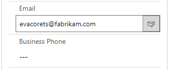

# activeTAPI for Power Apps & Dynamics 365

If you are looking for [**technical documentation** go to GitHub Pages](https://schmidteservices.github.io/activeTAPI-Dyn365/).

Validate and format telephone numbers for Microsoft **Power Apps** and **Dynamics 365**. Improve your data quality significantly with clean and valid telephone numbers.

 

```
004989334455	-->	+49 (89) 334455
+1 100 445566	-->	Invalid area code: Area Code 100 does not exist in Country +1
02623 445566	-->	+1 (262) 345566
```

#### Microsoft Dynamics 365 - Validate a telephone number


## Technical documentation

You'll find the technical documentation on [GitHub Pages](https://schmidteservices.github.io/activeTAPI-Dyn365/) or in the repositories `docs` folder.

## Marketing and Licensing

Marketing an licensing information can be found on http://activeTAPI.net.

In case of any question, [contact us by e-mail](mailto:support@activeTAPI.net).

&copy; 2019, Schmidt e-Services GmbH i.L
Niedernhausener Straße 59a
D-65207 Wiesbaden
