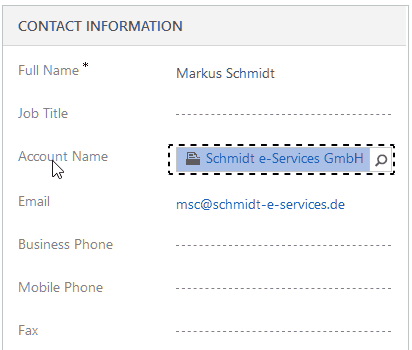
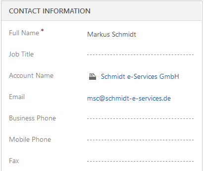

# activeTAPI for Microsoft Dynamics 365

activeTAPI for Dynamics 365 adds telephone number validation and formatting to your Microsoft Dynamics 365 application. Improve your data quality significantly with clean and valid telephone numbers.

```
004989334455	-->	+49 (89) 334455
+1 100 445566	-->	Invalid area code: Area Code 100 does not exist in Country +1
02623 445566	-->	+1 (262) 345566
```

#### Microsoft Dynamics 365 - Format a telephone number



#### Microsoft Dynamics 365 - Validate a telephone number



You'll find the technical documentation about how to install in out GitHub Wiki.

Marketing an licensing information can be found on http://activeTAPI.net.

In case of any question, [contact us by e-mail](mailto:support@activeTAPI.net).

&copy; 2019, Schmidt e-Services GmbH i.L
Niedernhausener Straße 59a
D-652077 Wiesbaden
