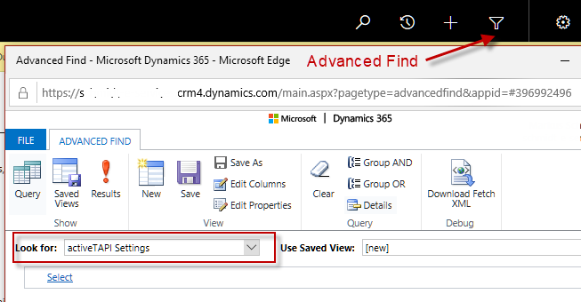

# Settings Entity

activeTAPI comes with its own settings entity `mspro_settings`. 

> [!NOTE]
>
> Unfortunately, in Dynamics 365 Online, there is no way to add custom entities to an organization's Customization.Settings menu. If you're using Dynamics 365 on-Premise you will find the entity there.

Use *Advanced Find* to open the Settings Entity.

This entity is a simple key-value list.

> [!WARNING]
> Please notice the keys and values are Case-Sensitive!

## ActiveTAPI.ClientId <a name=clientid/>

You will get this key from your vendor when you have purchased an activeTAPI license. By default, when this settings does not exist, activeTAPI uses the [shared license](http://activetapi.net/licensing/sharedlicense/?target=_blank).

## ActiveTAPI.ServiceUrl

The Url which is used by the Plug-in to access the activeTAPI-REST Service. 

Right now, there are two options for this:

a)	https://activetapi.azurewebsites.net	-	depreciated (dotnet core 2.2), still default

b)	https://activetapi3.azurewebsites.net	-	new service (dotnet core 3.1)

Both Urls have the same functionality. However, only *activetapi3* will continue to evolve, because Microsoft has discontinued support for dotnet 2.2 (current url). Future releases of activeTAPI will reference *activetapi3*, by default.