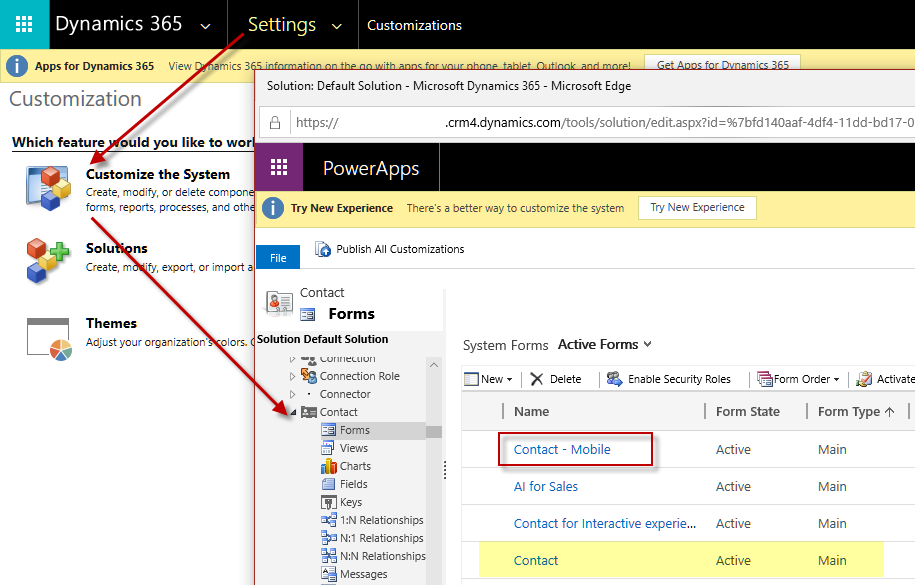
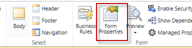
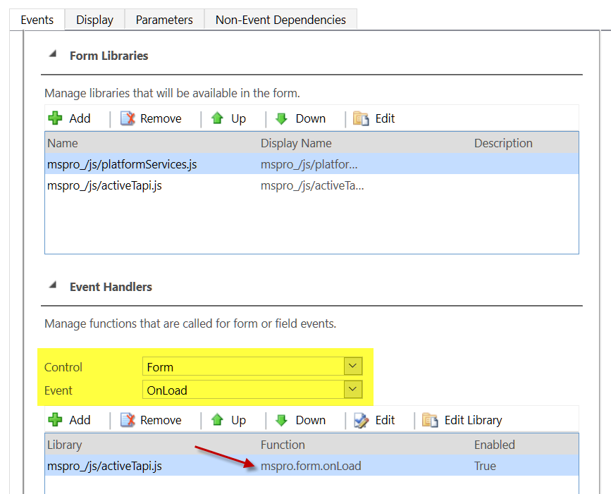
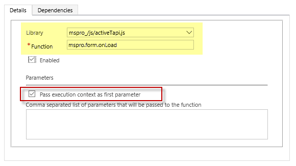

# Extend Integration

Via `Settings.Customizations Customize the System` navigate to the Entity and the Form where you want to integrate telephone number formatting (see also [Out-of-the-box Integration](../solution/oob_integration.md)).

Select the Form - for example *Contact - Mobile* and open *Form.Properties*.

> [!NOTE]
> Microsoft is going to change UIs in 2020. All screenshot were taken in Dynamics 365 Online (Jan 2020). However.

Add the two JavaScripts as shown below to your Form Libraries. There might be other scripts already, but this does not matter. **Make sure, `platformservices.js` is listed before `activeTAPI.js`.**

In addition, you need to register the function `mspro.form.onLoad` and pass execution parameters in the Form's OnLoad event.

> [!WARNING]
> All string are casse-sensitive because it is JavaScript!

