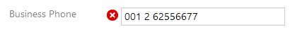

# Show-Cases

## Prerequisites

Please make sure _activeTAPI for Microsoft Dynamics 365_ is [installed properly](../solution/oob_integration.md). Then _activeTAPI_ is active on the **Contact Main Form**.

## Enter a valid telephone number

1. Navigate to the Contact Main Form
2. Create a new Contact and

   enter a _Business Phone_ telephone number

   

3. Leave the field
4. Check the result: activeTAPI has formatted your 'number sequence' into a canonical number.

   


The first time when you use activeTAPI it may take several seconds \(up to 30 sec\) until you see the results.


## Enter an invalid area code

In Germany, 0141 is an unknown area code. Let's simulate a typo and enter `0141 556677` instead of the correct `0151 556677` - which is a mobile number.

_Country: guessed_: The entered number did not contain a country code. That's why activeTAPI is 'guessing' a configurable default country code. In this case +49 for Germany.

_Area: uncertain_: activeTAPI could not find any match for the given area, in the guessed country. activeTAPI won't claim, the area is definitely invalid because area codes change frequently.

Let's fix the area code to `151`and see what happens:

Obviously activeTAPI has adjusted the area code, and it seems even area code `151`is only half the truth: `15112` is the full area code:

## Country codes

Let's play with country codes: +1 is the country code for the United States of America \(and other countries\). activeTAPI recognizes a leading '00' or a '+' as: _the number starts with a country code_.

activeTAPI recognized the country is ok, however for this country somethings is wrong with the area code:

Fix area code to:

and activeTAPI takes care of the rest.

If you try an invalid country code, you might see this:


In case, you have a telephone number where you think formatting is not correct, let us have a look! Send us the number you entered and we will check!

