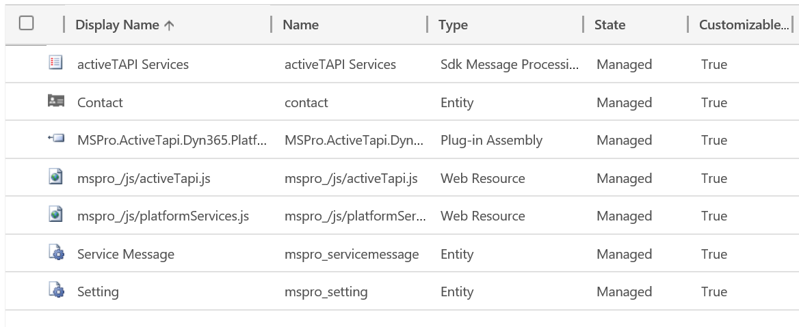

# Solution Package

activeTAPI does not change or modify any functionality in your organization. The Solution, and also the functionality, are completely separated from all existing items and functionality!

| Field                  | Content                                          |
| :--------------------- | :----------------------------------------------- |
| Publisher Display Name | Markus Schmidt - Dyn365 Pro                      |
| Publisher Name         | markusschmidtpro                                 |
| Prefix                 | `mspro`                                          |
| Website                | [https://activeTAPI.net](https://activeTAPI.net) |

> [!NOTE]
> The image may look slightly different, depending whether you're using on-Premise or Online version. 

activeTAPI install as a managed solution \(version may differ, of course\). 

The package content of version 1.0.2, for example, looked like follows.

See also [Solution Components in detail](components.md)