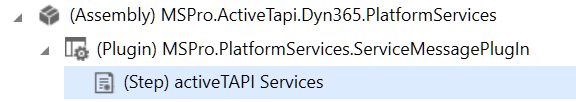
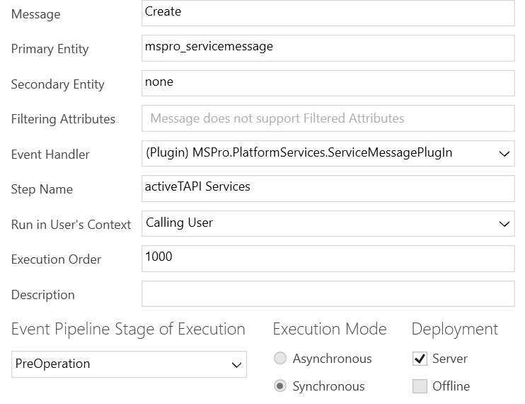

# Solution Components

The _activeTAPI Managed Solution_ contains the following components. 

## Entities

> [!NOTE]
>
> All entities are configured to show up under `Settings --> Extensions`. However, with **Dynamics 365 Online** - especially if you installed the Solution from AppSource - all `mspro_` entities are not shown in your solution. The only way to display those entities is using *Advanced Find*.
>
> 

### mspro\_servicemessage

This is a core entity of the *[MSPro-Dynamics Services Platform](~/_content/serviceplatform/README.md)*. This entity does not have a user-interface.

### mspro\_settings

This entity contains all settings required for activeTAPI. After solution import, this entity is empty and the configuration keys need to be set manually, when required \(see [activeTAPI configuration](https://github.com/SchmidteServices/activeTAPI-Dyn365/tree/f5ae9583b31952ca3f3ff42e5b6e11242bfd569d/docs/dyn365/admin/settingEntity.md)\).

## JavaScript

### mspro_/js/activeTapi.js

Contains the activityTAPI functionality which will be active on the form where this script is beeing used (see [Extend Integration](../installation/extend-integration.md)).  `OnForm.Load()` `activeTAPI.js` registers `OnChanged` handlers,  for all *Phone* attributes, as follows:

```JavaScript
onLoad: function (executionContext) {
  ...
  // ZERO CONFIG: 
  // * get all attributes with format = 'phone'
  // * Add 'fax' - which is not a 'phone' field :-(
  // and register activeTAPI handle for these fields.
  //
  formContext.data.entity.attributes.get().forEach(function (a) 
  {
    if (a.getFormat() == 'phone' || a.getName() == 'fax') 
    {
        // ... register on attribute changed ... 
        register onAttributeChanged() handler
    }
  }
}
                                                   
onAttributeChanged() // _formatTelephoneNumber
{
	mspro.platformServices.sendMessage("ActiveTapi.FormatNumbers", ...
}
```

### mspro_/js/platformServices.js

This script belongs to [MSPRo Dynamics Platform Services](~/_content/serviceplatform/README.md). It contains only a single method allowing a form to execute platform services. `activeTAPI.js` uses it to send messages to 'the platform' when a form attribute's content changed `Attribute onChanged() Event`:

```JavaScript
mspro.platformServices.sendMessage("ActiveTapi.FormatNumbers",
{ 
  "phoneNumbers" : [ changedAttribute.getValue() ],
},
function (result, data) { ...
```

> [!NOTE]
>
> It is important to mention that the scipts do communicate with your Dynamics CRM 365 server, **using standard SDK functionality, only**: 
>
> `Xrm.WebApi.createRecord("mspro_servicemessage", serviceMessage).then( ...`. 
>
> The client will not call or use any resource outside of your safe & sandboxed Microsoft Dynamics CRM 365 environment!

## Plugin

activeTAPI uses one Plugin, which belongs to [MSPRo Dynamics Platform Services](~/_content/serviceplatform/README.md). Its functionality is to execute the business logic that was requested by the client (see JavaScript *SendMessage*). In case of activeTAPI, the sandboxed Plug-in executes the REST calls to the [activeTAPI-REST Service](~/_content/actrest/README.md).

> [!NOTE]
>
> This means, all activeTAPI logic is server-side and executes in the context of this Plugin.

The Plug-in is registered on the `mspro_servicemessage`entity as follows:






[!NOTE]

It is important to notice that this Plug-in is registered on the `mspro_servicemessage` entity, only, which is part of the activeTAPI Solution. The Plug-in does run in the pipeline of any existing entity!