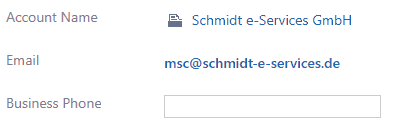
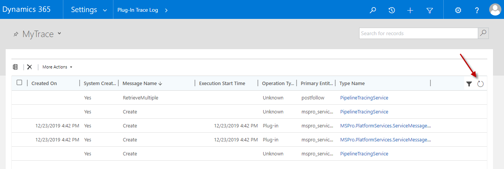

# Gather information

If you see activeTAPI does do anything,

follow these steps:

1. Contact your Administrator! Honestly! Bus as a user you won't be able to see any of the details behind the curtain, of course.
2. As an Administrator: **Enable Plug-In Trace Log**

    

   NOTE: Depending whether you're using Dynamics 365 Online, Power Apps or on Dynamics 365 On-Premise, there are different way to accomplish this. Finally, you will find the _Plug-In Trace Log_ here:

   

3. Before we can see anything, we need to **reproduce the 'problem'**.
4. Enter a telephone number and let activeTAPI \(try to\) format it. Well, activeTAPI does not actually format the telephone number. That is the reason why you're reading these pages, isn't it? But now, you have got some more information!
5. Navigate to the _Plug-In Trace Log_ entity \(see above\). **Refresh your view** and, you should see some records:

   

If there is a _Exception_ it is very important to get the complete exception information. Select, copy and past and open with any editor. Maybe you can immediately see what is wrong, otherwise check the _Knowledge Base_ for the exception message, or send us an e-mail.

Normally the records which explicitly refer to _MSPro.PlatformServices.ServcieMessage_ contains more and better information.

If you encounter an **empty message block**, the Plug-in was not even executed. [Continue reading here](https://github.com/SchmidteServices/activeTAPI-Dyn365/tree/ffce5a1389e75d04c48de638ce4140637d38a7b6/docs/dyn365/kb/emptyMessageBlock.md).
