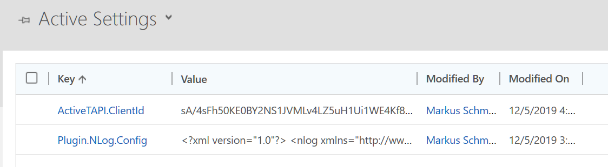

# Settings Entity

activeTAPI comes with its own settings entity. This entity is a simple key-value list:

The keys listed below can be used.


Please notice the keys and values are Case-Sensitive!


## ActiveTAPI.ClientId

You will get this key from your vendor when you have purchased your own license. Without this settings, activeTAPI uses the [shared license](http://activetapi.net/licensing/sharedlicense/?target=_blank).

