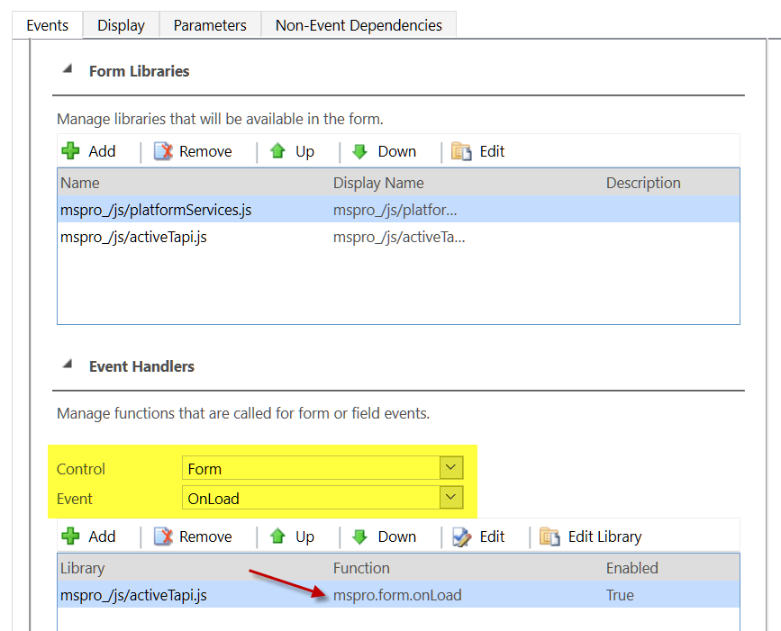

# Solution Package

## 

> Thanks to [_MSPro Dynamics Platform Services_](https://github.com/SchmidteServices/activeTAPI-Dyn365/tree/f5ae9583b31952ca3f3ff42e5b6e11242bfd569d/docs/dyn365/admin/servicePlatform/index.md), the Microsoft Dynamics 365 Solution \(the activeTAPI package\) does not change or modify any functionality in your existing organization. The solution, and also the functionality, are completely separated from all existing items.

The only connection point that is required to use _activeTAPI_ in your organization is a reference on those forms where you want to use telephone number formatting and validation. By default, activeTAPI is activated on the `Contact --> Main Form`, only.

This is, by the way, the only modification activeTAPI makes to your Microsoft Dynamics 365 organization.

