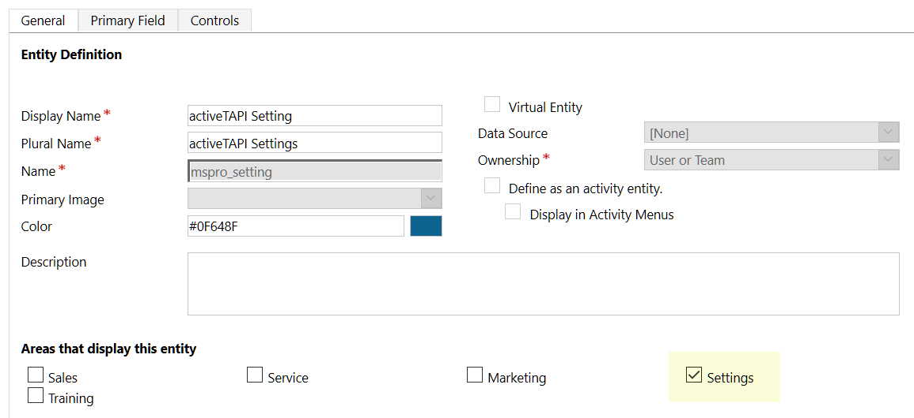

# Solution Components

| Field | Content |
| :--- | :--- |
| Publisher Display Name | Markus Schmidt - Dyn365 Pro |
| Publisher Name | markusschmidtpro |
| Prefix | `mspro` |
| Website | [http://activeTAPI.net](http://activeTAPI.net) |

The _activeTAPI Managed Solution_ contains the following components:

## Entities

### mspro\_servicemessage

This is a core entity of the _MSPro-Dynamics Services Platform_. This entity does not have a user-interface.

### mspro\_settings

This entity contains all settings required for activeTAPI. The entity is available under `Settings --> Extensions --> activeTAPI Settings`. After solution import, this entity is empty and the configuration keys need to be set manually, when required \(see [activeTAPI configuration](https://github.com/SchmidteServices/activeTAPI-Dyn365/tree/f5ae9583b31952ca3f3ff42e5b6e11242bfd569d/docs/dyn365/admin/settingEntity.md)\)

## JavaScript

The two JavaScript files:

* `mspro_/js/activeTapi.js`  and  
* `mspro_/js/platformServcies.js` 

The files contain the JavaScript lettings forms communicate with your Dynamics CRM 365 Server.

> It is important to mention that the Dynamics 365 Client will only communicate with your Dynamics CRM 365 server, using standard SDK functionality: `Xrm.WebApi.createRecord("mspro_servicemessage", serviceMessage).then( ...`. The client will not call or use any resource outside of your 'safe' Microsoft Dynamics CRM 365 environment.

## Plugin

activeTAPI uses one Plugin that is registered on the `mspro_servicemessage`entity as follows:

It is important to notice that this Plugin does not execute on any existing entity!

The purpose of this Plugin is, to execute activeTAPI service requests. This means, all activeTAPI logic is server-side and executes in the context of this Plugin.

