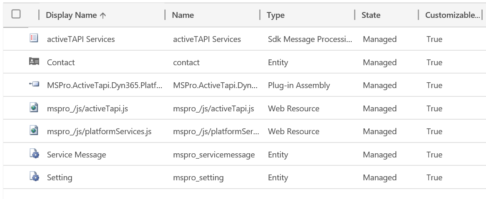

# Out-of-the-box Integration

Check the _activeTAPI Managed Solution_ is installed. The version may differ, of course: `Dynamics CRM 365 -> Settings --> Solutions`.

The package content of version 1.0.2, for example, looked like follows.

