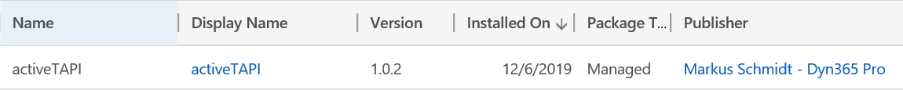

# Out-of-the-box Integration


The image may look slightly different, depending whether you're using on-Premise or Online version. 


activeTAPI install as a managed solution \(version may differ, of course\). 

The package content of version 1.0.2, for example, looked like follows.

