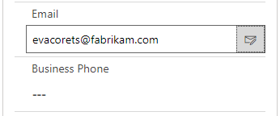

# Introduction

_activeTAPI for Microsoft Dynamics 365 & Power Apps_ is a Solution that extends Microsoft's Common Data Service.


_Solutions are how customizers and developers author, package, and maintain units of software that extend Common Data Service. For example, Dynamics 365 for Sales, Marketing, Customer Service apps are composed of solutions. Customizers and developers distribute solutions so that organizations can use Common Data Service to install and uninstall the business functionality defined by the solution. \(_[_ref. Microsoft Power Apps_](https://docs.microsoft.com/en-us/powerapps/developer/common-data-service/introduction-solutions)_\)_


The functionality is simple and powerful. It validates and formats telephone numbers while you're entering them.

Behind the scenes, all activeTAPI validation and formatting logic comes from the [activeTAPI-REST Service](../../actrest/overview.md). The Solution itself contains only the components required to integrate this service with the Dynamics platform.

Out-of-the-box activeTAPI becomes active on your Dynamics 365 **Contact Main Form**, only. However, you can configure activeTAPI to format telephone numbers wherever you want - [more...](../admin/) .

## activeTAPI-Dyn365

In short, the product is called _**activeTAPI-Dyn365**_. It has passed Microsoft tests and it is available on _AppSource_, as well as a separate [download](https://github.com/SchmidteServices/activeTAPI-Dyn365/tree/master/download) \(Solution ZIP package\).


You may use the ZIP package for installation on your Microsoft 365 CRM On-Premise environment.


