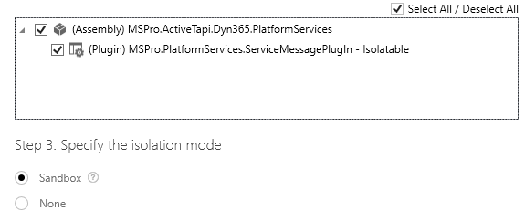
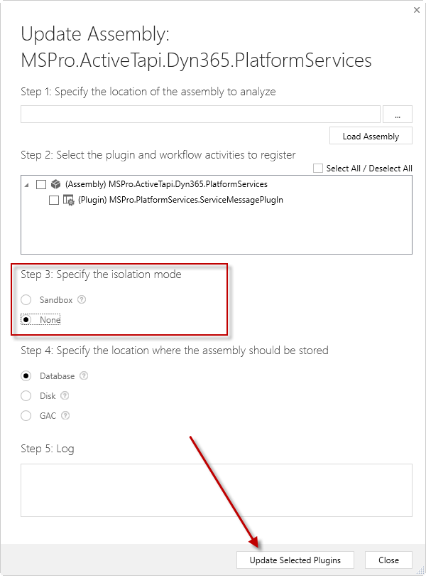
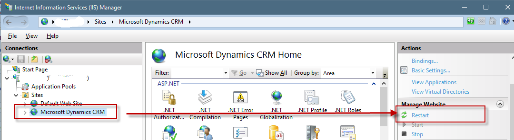

parent: Knowledge Base
title: FileIOPermission
nav_order: 1100
has_children: true
has_toc: false
---

# FileIOPermission / SecurityException Exception

## Exception Details

```
Unhandled Exception: System.Reflection.TargetInvocationException: Exception has been thrown by the target of an invocation.
...
Inner Exception: Microsoft.Crm.CrmException: System.Security.SecurityException: Request for the permission of type 'System.Security.Permissions.FileIOPermission, mscorlib, Version=4.0.0.0, Culture=neutral, PublicKeyToken=b77a5c561934e089' failed.
at System.Security.CodeAccessSecurityEngine.Check(Object demand, StackCrawlMark& stackMark, Boolean isPermSet)
...
The action that failed was:
Demand
The type of the first permission that failed was:
System.Security.Permissions.FileIOPermission
The first permission that failed was:
<IPermission class="System.Security.Permissions.FileIOPermission, mscorlib, Version=4.0.0.0, Culture=neutral, PublicKeyToken=b77a5c561934e089"
version="1"
PathDiscovery="C:\Program Files\Dynamics 365\Server\bin\Microsoft.Crm.Sandbox.Helper.dll"/>
...
```

We have seen this message on in On-Premise enviromments, when the *ServiceMessagePlugin* is registered in *Sandbox Mode*. The error did not occur in online enviroments:



The only solution we have found is, to change the execution mode to `None` . You can do this, with the Plug-in Registration Tool from SDK. 



After changing, **restart the CRM Web-Service**.

