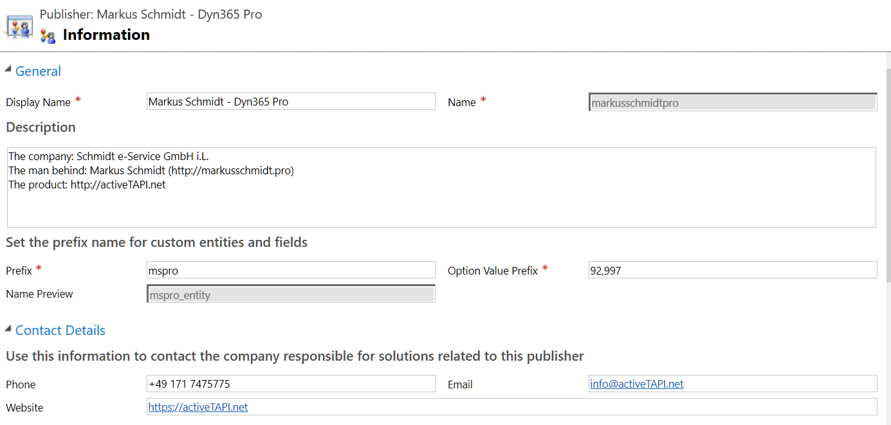
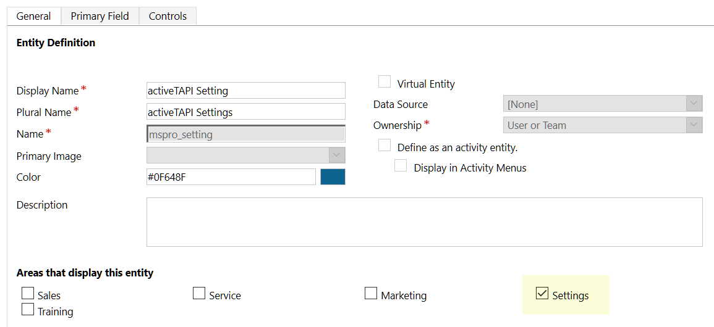

# Solution Components

| Field | Content |
| -------------- | --------------------------- |
| Publisher Display Name  | Markus Schmidt - Dyn365 Pro |
| Publisher Name | markusschmidtpro |
| Prefix | `mspro` |

The *managed Solution* contains the following components (see also: [Solution Overview](index.md))

## Entities

### mspro_servicemessage

This is a 'helper' entity that is used as a *core* entity to communicate with a Dynamics Service based on messages. This is an 'internal' entity with out any user-interface.

### mspro_settings

This entity contains all settings required for activeTAPI. The entity is available under `Settings --> Extensions --> activeTAPI Settings`.

After solution import, this entity is empty and the configuration keys need to be set manually, when required (see [activeTAPI configuration](..\configuration\activeTapiSettingEntity.md))

## JavaScript

The two JavaScript files `mspro_/js/activeTapi.js`  and  `mspro_/js/platformServcies.js` contains the JavaScript which is required to communicate with your Dynamics CRM 365 Server.

> It is important to mention that the Dynamics 365 Client will only communicate with your Dynamics CRM 365 server, using standard SDK functionality: `Xrm.WebApi.createRecord("mspro_servicemessage", serviceMessage).then( ... `. The client will not call or use any resource outside of your 'safe' Microsoft Dynamics CRM 365 environment.

## Plugin

activeTAPI uses one Plugin that is registered on the `mspro_servicemessage`entity as follows:

It is important to notice that this Plugin does <u>not</u> execute on any existing entity!

The purpose of this Plugin is, the execute all activeTAPI requests. This means, all activeTAPI logic is server-side and executes in the context of this Plugin.

